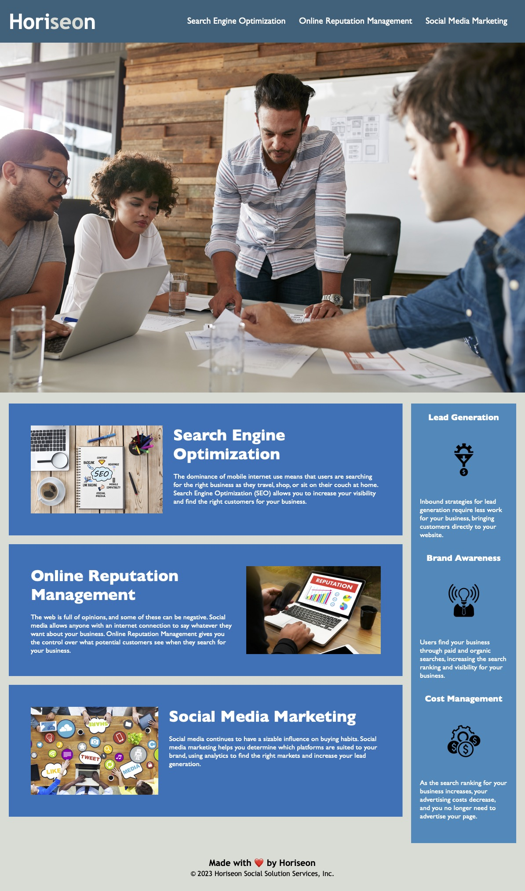

# Horiseon Website - Search Engine Optimization
This project consisted of refactoring and reorganizing the codebase to this webpage in order to make it more accessible and to optimize search engine compatibilty.

## User Story
As a marketing agency, we wanted to create a codebase that is optimized for search engines and accessibilty features - and then, we wanted to share it with the world! Horiseon aims to ease the burden of refactoring and reorganizing codebases and provide our customers with a clean, polished result; without changing the appearance/functionality that currently exists.

## Technologies 
This website utlizes semantic HTML structures combined with CSS styling in order to create a beautiful landing page for those looking to optimize their own websites in a similar fashion!

## Landing Page Preview
Check us out [here](http://beckpull.github.io/horiseon-optimization) - and use Chrome DevTools to see our semantics! If you like what you see - reach out for more! 

#### Contributors:
* Horiseon   
* **Rebecca Feltman:** check me out on [GitHub](https://github.com/beckpull) or shoot me an [email](mailto:beckpull@icloud.com) if you have any website needs!
